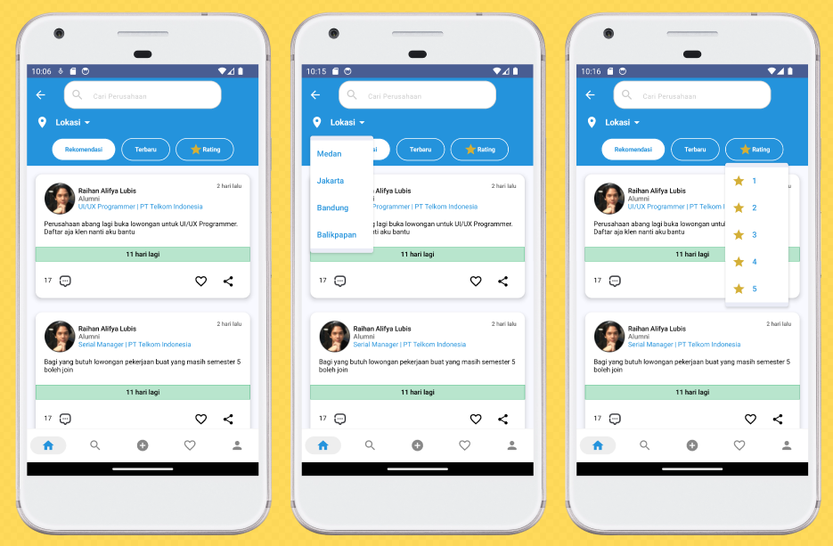
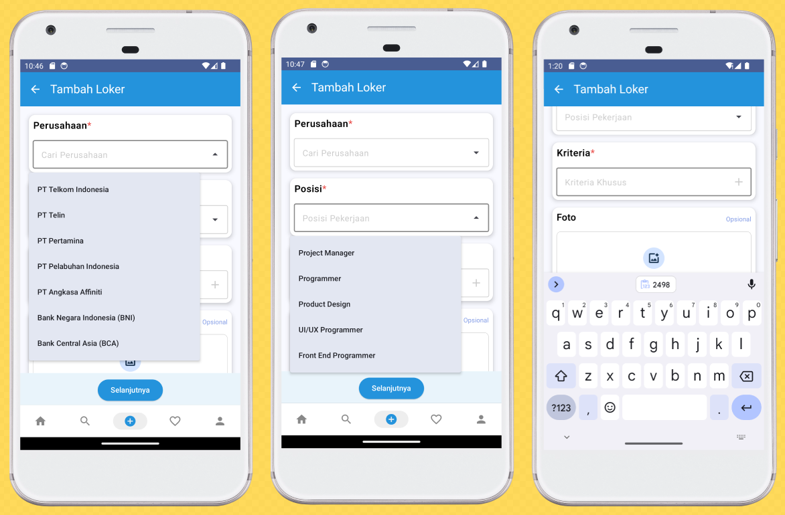

# IT Jobstreet
KOM B\
Proyek Tugas Besar Pemrograman Mobile

## Link figma yang telah dirancang tim design:
[IT Jobstreet](https://www.figma.com/file/a89hDq6WF8QqWxgDpkBd8k/IT-JobStreet?type=design&node-id=42-2673&mode=design&t=ApOfmFkvyTgiPHi8-0)

## Disusun oleh:
- Atikah Husna 201402020
- Indah Zahrani Lubis 201402047
- Wynne Jovita Taslim 201402074

## Tujuan aplikasi IT Jobstreet:
- Membantu alumni fasilkomti mencari peluang kerja dan membantu perekrut untuk mendapat pekerja
- Membuat alumni terhubung dengan komunitas pencari kerja yang memiliki latar belakang almamater yang sama

## Tampilan yang ada di aplikasi IT Jobstreet:
- ### Login
  
  Tampilan ini berfungsi agar pengguna dapat masuk ke aplikasi IT Jobstreet menggunakan nim atau email usu dan password.\
  Jika terdapat kesalahan akan muncul tampilan seperti gambar kedua.\
  Jika tidak terdapat kesalahan akan muncul tampilan seperti gambar ketiga.
- ### Pilih Pekerjaan
  
  Tampilan ini berfungsi agar pengguna dapat memilih pekerjaan yang diinginkan.\
  Pengguna dapat melakukan cari pekerjaan dengan memasukkan kata kunci pada kolom search.\
  Jika pengguna mengklik salah satu pekerjaan maka akan muncul tampilan seperti gambar kedua.\
  Jika pekerjaan tidak ditemukan maka akan muncul tampilan seperti gambar ketiga.
- ### Pilih Lokasi Pekerjaan
  \
  Tampilan ini berfungsi agar pengguna dapat memilih lokasi pekerjaan yang diinginkan.\
  Pengguna dapat memilih beberapa lokasi pekerjaan yang diinginkan.\
  Pengguna dapat melakukan cari pekerjaan dengan memasukkan kata kunci pada kolom search atau mengklik lokasi yang tertera pada layar.\
  Jika pengguna mengklik salah satu lokasi pekerjaan maka akan muncul tampilan seperti gambar kedua.
- ### Home
  \
  Tampilan ini merupakan halaman home pengguna, dimana pengguna dapat melihat postingan lowongan kerja baik yang berdasarkan rekomendasi, terbaru, dan rating, seperti gambar pertama.\
  Jika pengguna mengklik tombol "Lokasi" maka akan muncul dropdown berisi lokasi yang memiliki lowongan kerja, dimana postingan lowongan kerja akan difilter sesuai dengan lokasi yang dipilih, seperti gambar kedua.\
  Jika pengguna mengklik tab rating maka akan muncul dropdown berisi rating 1-5, dimana postingan lowongan kerja akan difilter sesuai dengan rating dari suatu perusahaan, seperti gambar ketiga.\
  \
  Jika pengguna mengklik icon hati pada suatu postingan lowongan kerja maka postingan tersebut akan masuk ke halaman "Favorite", seperti gambar pertama.\
  Jika pengguna menglik icon share pada suatu postingan lowongan kerja maka pengguna dapat membagikan info link postingan suatu lowongan kerja, seperti gambar kedua.\
  \
  Tampilan ini merupakan halaman detail dari suatu postingan lowongan kerja, dimana pengguna dapat melihat informasi yang lebih rinci baik batas waktu pendaftaran, poster, hingga kriteria yang dibutuhkan dari suatu perusahaan tersebut, seperti gambar pertama.\
  Jika pengguna mengklik icon komentar maka akan muncul bottom sheet komentar untuk postingan lowongan kerja tersebut, seperti gambar kedua.\
  Jika pengguna mengklik tanggal pendaftaran maka akan muncul bottom sheet sisa waktu masa pendaftaran dari suatu lowongan kerja, seperti gambar ketiga.
- ### Search
  \
  Tampilan ini berfungsi agar pengguna dapat melakukan pencarian terhadap postingan, orang, ataupun perusahaan.\
  Pencarian yang dilakukan dapat diseleksi dengan memilih lokasi penerbitan postingan, lokasi orang yang dicari, ataupun lokasi perusahaan yang diinginkan.\
  Tampilan pencarian berdasarkan postingan terdapat pada gambar pertama, yang berisikan isi postingan, profil singkat dari pengguna yang memposting, tanggal diposting dan batas waktu postingan lowongan kerja tersebut dibuka.\
  Pada tampilan ini pengguna dapat memberikan komentar, likes, ataupun membagikan postingan.\
  Tampilan pencarian berdasarkan orang terdapat pada gambar kedua, yang berisikan profil singkat dari pengguna yang memposting.\
  Tampilan pencarian berdasarkan perusahaan terdapat pada gambar ketiga, yang berisikan profil singkat perusahaan yang sedang membutuhkan lowongan kerja.\
  \
  Tampilan ini muncul ketika pengguna mengklik ikon filter pada sudut kanan atas.\
  Pada tampilan ini pengguna dapat melakukan filter pada tipe pekerjaan dan bidang pekerjaan yang diinginkan.
- ### Tambah Loker
  \
  Pengguna dapat menambahkan loker dengan cara mengisi box isian form pada card Perusahaan, Posisi, Kriteria, Foto dan Tanggal Pendaftaran loker.\
  Form card Perusahaan, Posisi, dan Kriteria merupakan form yang wajib diisi. Sedangkan Form card Foto dan Tanggal Pendaftaran merupakan form opsional.
  
  \
  Tampilan ini berfungsi untuk mengisi form pada card Perusahaan, Posisi dan Kriteria. \
  Pada card Perusahaan dan Posisi, form berbentuk dropdown yang interaktif karena pengguna dapat memilih salah satu opsi dari daftar perusahaan dan posisi pekerjaan yang ada atau menginput nama perusahaan dan posisi pekerjaan yang tidak ada dalam daftar tersebut.\
  Pada card Kriteria, form berbentuk textfield yang memungkinkan pengguna untuk menambahkan lebih banyak field untuk kriteria khusus pada loker sesuai kebutuhan mereka.
  
  \
  Tampilan pertama berfungsi untuk mengupload gambar dari penyimpanan lokal dan tampilan kedua berfungsi untuk membuat range untuk tanggal pendaftaran loker.
  
  \
  Tampilan ini berfungsi ketika pengguna tidak mengisi form yang wajib diisi. Pengguna wajib mengisi form tersebut agar pengguna dapat menambahkan loker pada aplikasi.\
  Nantinya ketika semua form sudah terisi, klik tombol selanjutnya untuk menuju ke halaman selanjutnya dari pengisian form loker.
  
  \
  Tampilan pertama merupakan halaman selanjutnya dari pengisian form loker. Pada tampilan ini terdapat form card deskripsi yang wajib diisi dan form card Tambah Tag yang sifatnya opsional.\
  Tampilan Kedua berfungsi ketika pengguna tidak mengisi form deskripsi. Pengguna wajib mengisi form tersebut agar bisa melakukan posting loker.
  
- ### Favorit
  \
  Tampilan ini berfungsi ketika pengguna menyukai suatu postingan lowongan kerja, postingan tersebut dapat tersimpan dan mudah untuk dilihat kembali jika dibutuhkan.\
  Jika ikon hati ditekan maka ikon hati akan berubah warna menjadi abu-abu.
- ### Profil
  \
  Tampilan ini merupakan halaman profil pengguna yang berisi informasi berupa nama, asal universitas, lokasi, link linkedin, dan tanggal kelulusan pengguna. Dimana pada halaman ini terdapat tab posting, komentar dan review. \
  Tab posting berfungsi agar pengguna dapat melihat postingan lowongan kerja yang telah diunggah oleh pengguna, seperti pada gambar pertama. \
  Tab komentar berfungsi agar pengguna dapat melihat komentar apa saja yang telah dikirim pengguna pada suatu postingan lowongan kerja, seperti pada gambar kedua. \
  Tab review berfungsi agar pengguna dapat melihat review apa saja yang telah diberi pengguna pada suatu perusahaan, seperti pada gambar ketiga. \
  \
  Tampilan ini berfungsi untuk mengubah profil pengguna ketika pengguna mengklik tombol "Edit profil", dimana pengguna diminta untuk memasukkan foto, nama, email, password baru, bio, alamat, dan tautan pengguna.
- ### Rating
